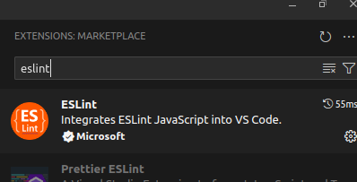
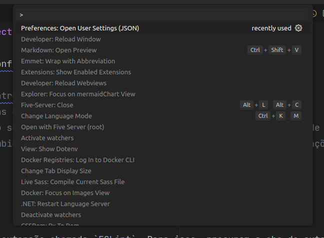

# Projeto Integrador

## Sumário

1. [Configuração De Ambiente](#environment-configuration)
  - [Instalação do Nodejs](#nodejs-instalation)
  - [Como puxar o repositório para o meu computador?](#how-to-pull)
2. [Baixando e configurando ESLint](#make-eslint-configurations)
3. [Boas práticas do trabalho com git](#good-practices)

<a id="environment-configuration"></a>

## Configurações De Ambiente

<a id="nodejs-instalation"></a>

### Instalação do Nodejs

1. Verifique se você possue o `Node.js` instalado executando o seguinte comando: `node --version`. Se o comando não retornar
a versão do Node.js, então siga para os próximos passos. Caso contrário, pule para a próxima sessão.
2. Instale o Node.js no seu computador seguindo o passo a passo abaixo que corresponde ao seu sistema operacional.
  - Windows:
    - Acessar o site oficial do Node.js [https://nodejs.org/en](node.js)
    - Baixar a versão LTS (Long-Term Support)
    - Execute o primeiro passo para verificar se a instalação foi concluída com sucesso
      - Caso ainda não funcione, tente executar os seguintes passos:
        1. Feche e abra o seu terminal
        2. Execute novamente o comando `node --version`. Caso ainda não funcione, execute os próximos passos.
        3. Abra o Power Shell em modo administrador
        4. Execute o seguinte comando: `Set-ExecutionPolicy -ExecutionPolicy RemoteSigned`
        5. Rode novamente o comando `node --version`.
  - Mac:
    - No terminal no Mac, insira os seguintes comandos:
      ```bash
        /bin/bash -c "$(curl -fsSL https://raw.githubusercontent.com/Homebrew/install/master/install.sh)";
        brew update;
        brew install node;
      ```
    - Em seguida, execute `node --version` e confirme se a instalação foi concluída com sucesso
  - Linux
    - No terminal no Linux, insira os seguintes comandos:
      ```bash
        sudo apt update
        sudo apt install curl
        sudo curl -o- https://raw.githubusercontent.com/nvm-sh/nvm/v0.39.5/install.sh | bash
        nvm install --lts
      ```

<a id="how-to-pull"></a>

### Como puxar o repositório para o meu computador?

1. Para trazer o repositório do GitHub para o seu computador, execute um dos seguintes comandos (o mais comum é p HTTPS, mas se souber o que está fazendo, pode executar qualquer um dos outros):
    - HTTPS
        ```bash
          git clone https://github.com/Interdisciplinary-Project/Frontend.git
        ```
    - SSH
        ```bash
          git clone git@github.com:Interdisciplinary-Project/Frontend.git
        ```
    - GitHub CLI
        ```bash
          gh repo clone Interdisciplinary-Project/Frontend
        ```
2. Agora, execute os seguintes comandos para configurar o seu ambiente de desenvolvimento:
    ```bash
      cd Frontend # Este comando irá entrar dentro da pasta do projeto
      npm i # Este comando irá instalar todas as dependências necessárias para rodar o projeto
      code . # Este comando só deverá ser usado se você estiver usando o Visual Studio Code como Editor de Código Fonte
      npm run dev # Este comando irá rodar o ambiente de desenvolvimento onde você poderá ver suas alterações em tempo real
    ```

<a id="make-eslint-configurations"></a>

### Baixando e configurando o ESLint

1. Inicialmente se faz necessário instalar uma extensão chamada `ESLint`. Para isso, procurem a aba de extensões (ou usem o atalho `ctrl+x`). Daí, pesquisem por `ESLint` e irá aparecer a extensão abaixo. Instale-a e vá para o próximo passo.



2. Agora, com a extensão já instalada, você deve abrir o JSON de configurações do VSCode. Para isso, use o atalho `ctrl+shift+p`. Irá aparecer a seguinte barra de pesquisa:



3. Agora, pesquise `Preferences: Open User Settings (JSON)` e tecle `Enter`.
4. Dentro do par de {} que irá ter neste arquivo (caso ele não tenha nenhuma configuração previamente preenchida), insira os comandos abaixo


<a id="good-practices"></a>

## Boas práticas do trabalho com git

Quando se trabalha em um repostiório de código compartilhado utilizando Git, existem algumas práticas que são interessante de se seguir. Segue uma lista do que sempre (ou quase sempre) deve ser feito antes de iniciar qualquer desenvolvimento.

1. Sempre que for realizar alguma alteração no código, crie uma nova branch a partir da main. Para fazer isso, siga os seguintes passos:
  - Execute o comando `git switch main` para garantir que você está na branch principal
  - Execute `git switch -c NOME_DA_SUA_BRANCH` para criar uma nova branch a partir da main
  - Faça todo o seu desenvolvimento. Então, quando quiser enviar as suas alterações para o GitHub, execute:
      ```bash
        git add .
        git commit -m "AQUI_VAI_UMA_MENSAGEM_DE_COMMIT_QUE_DESCREVA_DE_FORMA_CLARA_AS_SUAS_ALTERAÇÕES"
        git push origin ESCREVA_AQUI_O_NOME_DA_SUA_BRANCH
      ```
  - Vá até o seu GitHub, no repositório Frontend, e clique no botão verde de `Compare & Pull Request`.
    
  - Confira se a sua branch está na direita e na esquerda está a branch main
    
  - Clique no botão de `Create Pull Request`
    
  - Ao fim, você chegará nesta tela. Não faça mais nada e avise alguém para revisar o código (pelo WhatsApp mesmo) e fazer o merge do seu código com a branch principal
    
2. Sempre que finalizar uma tarefa e for iniciar a próxima tarefa garanta que a sua branch main esteja atualizada e jamais crie novas branchs de desenvolvimento a partir de qualquer outra branch que não seja a main. Assim, após a criação do seu `Pull Request`, execute os seguintes passos:
    ```bash
      git switch main
      git pull origin main # Se tiver confiança, pode executar somente git pull
      # Aqui você pode criar sua nova branch de desenvolvimento normalmente e seguir trabalhando
    ```
3. Garanta que o seu código esteja funcionando antes de subir para o GitHub. Ou seja, teste o que você fez e garanta que não quebrou também o que já estava pronto anteriormente.
